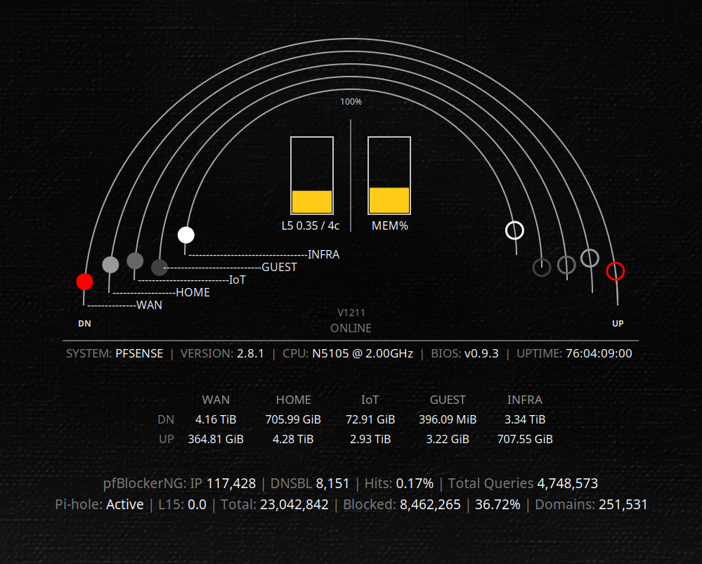

# pfSense Widget (gtex62-clean-suite)

A dedicated pfSense Conky widget with live multi-arc traffic markers, load/memory meters,
totals table, and pfBlockerNG/Pi-hole status. Data is collected via SSH and rendered in Lua.

## Status

Active and fully wired.

## Files

- `widgets/pfsense.conky.conf` — Conky entry point for this widget
- `lua/pf_widget.lua` — renderer and logic (arcs, markers, meters, tables, status)
- `theme-pf.lua` — pfSense theme knobs (layout, scaling, colors, arcs)
- `scripts/pf-fetch-basic.sh` — data fetch (pfSense + Pi-hole)
- `scripts/pf-rate-all-test.sh` — manual rate/smoothing test (not used by widget)
- `scripts/pf-rate-infra-test.sh` — manual rate test for INFRA (not used by widget)

## Features

- Multi-arc traffic markers for WAN/HOME/IOT/GUEST/INFRA
- LOAD (per-core) and MEM% center meters
- Interface totals table (cumulative bytes in/out)
- pfBlockerNG summary (IP/DNSBL/Total Queries)
- Pi-hole status line (active/offline, load, totals, domains)
- Theme-driven geometry, colors, fonts, and spacing

## Screenshots

### pfSense Widget



## Data sources

### pfSense (via SSH)

- `pfctl -vvsr` for pfBlockerNG IP packet counts (USER_RULE: pfB_, excluding DNSBL)
- `sqlite3 /var/unbound/pfb_py_dnsbl.sqlite` for DNSBL counters
- `sqlite3 /var/unbound/pfb_py_resolver.sqlite` for total queries
- `top`, `uptime`, `sysctl`, `netstat` for system + interface counters

Note: The Conky widget fetch does not execute PHP on pfSense. If you see crash-report PHP fatals mentioning `Command line code` and missing `/usr/local/www/pfblockerng/pfblockerng.inc`, that comes from ad-hoc CLI testing 

(`php -r ...`) or a separate pfSense-side script/cron. On pfSense 2.8.1 with pfBlockerNG-devel, the correct include path is `/usr/local/pkg/pfblockerng/pfblockerng.inc`.

### Pi-hole (via SSH to host in theme)

- `systemctl is-active pihole-FTL`
- `/proc/loadavg`
- `sqlite3 /etc/pihole/pihole-FTL.db`
- `sqlite3 /etc/pihole/gravity.db`

Note: `scripts/pf-fetch-basic.sh` uses `sudo -n sqlite3` on the Pi-hole host. Configure sudoers accordingly if needed.

## SSH Safety & Mitigation

The widget polls pfSense via SSH and includes a circuit-breaker to prevent sshguard lockouts.
If repeated SSH failures occur, polling is intentionally paused for a short cooldown.
During this time, the UI displays: SSH PAUSED - <reason> - <Ns>.

While paused:
- pfSense is still considered ONLINE.
- Traffic arcs drop to zero to indicate polling is paused.

After the cooldown, polling resumes automatically.

Common reasons and what they mean:
- AUTH: SSH authentication failed or credentials are not accepted.
- PF_SSH_FAIL: pfSense SSH failed from the fetch script.
- PF_LUA_SSH_FAIL: pfSense SSH failed from the Lua metadata fetch.

Manual recovery: run `scripts/pf-ssh-gate.sh reset` to clear the pause.

## Configuration

### Widget entry

`widgets/pfsense.conky.conf` loads `lua/pf_widget.lua` and controls window placement.

### Theme knobs

`theme-pf.lua` is the primary control surface. Key sections:

- `T.ifaces` — interface map (WAN/HOME/IOT/GUEST/INFRA)
- `T.link_mbps`, `T.link_mbps_in`, `T.link_mbps_out` — caps for normalization
- `T.scale` — linear/log/sqrt scaling and floors
- `T.pf.arc`, `T.pf.deltaR`, `T.pf.anchor_strength` — arc geometry
- `T.pf.center_meters` — LOAD/MEM bars
- `T.pf.arc_names` — dash leader + name labels
- `T.pf.totals_table` — totals table layout
- `T.pf.status_block` — pfBlockerNG + Pi-hole two-line block
- `T.poll` — fetch cadence (interfaces fast, full data slower)

## Usage

Start Conky with:

```
conky -c ~/.config/conky/gtex62-clean-suite/widgets/pfsense.conky.conf
```

## Installation

### 1) Install local dependencies

```bash
sudo apt update
sudo apt install -y conky-all openssh-client sqlite3
```

### 2) Ensure SSH access

```bash
ssh admin@<pfsense-host>
ssh <pihole-host>
```

Note: The Pi-hole host is configured in `theme-pf.lua` (see `T.pf.status_block.pihole.host`), or you can disable the Pi-hole line entirely.


### 3) Optional: passwordless sqlite3 on Pi-hole

If `sudo -n sqlite3` is not allowed on Pi-hole, add a sudoers rule:

```
pi ALL=(root) NOPASSWD: /usr/bin/sqlite3
```

## Quick Start (Minimal Setup)

1) Set pfSense host and interfaces:

   - In `theme-pf.lua`: `T.host` and `T.ifaces`
   - Or override the host at runtime with an environment variable:
     `PFSENSE_HOST=192.168.1.1`

   Where to set `PFSENSE_HOST`:

   - One-off run:
     `PFSENSE_HOST=192.168.40.1 conky -c widgets/pfsense.conky.conf`
   - Persist for your shell (add to `~/.bashrc`, `~/.zshrc`, or `~/.profile`):
     `export PFSENSE_HOST=192.168.40.1`
   - If you use this suite’s launcher:
     set it in `scripts/start-conky.sh` (it already exports a default).


2) Verify `scripts/pf-fetch-basic.sh` runs without prompts:
   
   ```
   ~/.config/conky/gtex62-clean-suite/scripts/pf-fetch-basic.sh full | head -n 20
   ```

3) Start the widget:
   
   ```
   conky -c ~/.config/conky/gtex62-clean-suite/widgets/pfsense.conky.conf
   ```

Optional:

- Pi-hole line: set `T.pf.status_block.pihole.enabled = false` to disable it.
- pfBlockerNG line: set `T.pf.status_block.pfb.enabled = false` to disable it.

## Troubleshooting

- If markers don’t move at low rates, lower `T.scale.sqrt.gamma` or the per-interface floors.
- If data updates feel jerky, increase `T.poll.medium` to reduce slow full fetch frequency.
- If Pi-hole stats are zero, verify SSH to `T.pf.status_block.pihole.host` and sudo for sqlite3.

## Porting notes

This widget is tailored to a specific pfSense + Pi-hole setup. To reuse it on another system:

- Set `T.host` and `T.ifaces` in `theme-pf.lua` to your pfSense host and interface names.
- Update `T.link_mbps`, `T.link_mbps_in`, and `T.link_mbps_out` to match your link speeds.
- Ensure SSH access to pfSense and the Pi-hole host (or disable the Pi-hole line in `T.pf.status_block`).
- Adjust layout offsets and sizes in `theme-pf.lua` for your display resolution.

## Notes

- The rate test scripts are optional helpers for porting/diagnostics and are not used by the widget.
- All fetch output is k=v sections parsed by `lua/pf_widget.lua`.

## Host configuration (pfSense)

Default host is `192.168.1.1`.

You can set the host in any of these places (highest priority first):

1) **Environment variable** (recommended for quick testing)
   - One-off:
     `PFSENSE_HOST=192.168.40.1 conky -c widgets/pfsense.conky.conf`
   - Persist for your user session (add to `~/.bashrc`, `~/.zshrc`, or `~/.profile`):
     `export PFSENSE_HOST=192.168.40.1`
   - Suite launcher (recommended for this repo):
     Edit `scripts/start-conky.sh` and set:
     `export PFSENSE_HOST="${PFSENSE_HOST:-192.168.40.1}"`

2) **theme-pf.lua**
   - Set `T.host = "..."`

If both are set, the environment variable wins.
