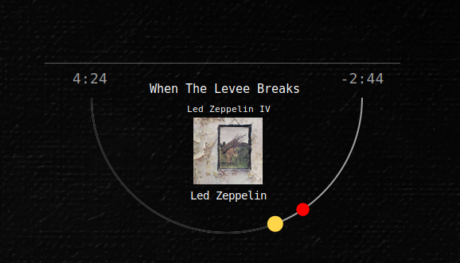

# gtex62-clean-suite

[](LICENSE)
[](https://github.com/GTex62/gtex62-clean-suite/stargazers)
[](https://github.com/GTex62/gtex62-clean-suite/issues)
[](https://github.com/GTex62/gtex62-clean-suite/commits/main)


A modular, minimalist Conky desktop suite for Linux Mint (and other
distros), inspired by several Rainmeter skins and rebuilt for Conky
using Lua, custom widgets, themed slash bars, GPU/VRAM bars, weather
arc, calendar, notes, and more.

This is a complete desktop system monitor and information panel set
while keeping everything text-first, elegant, and unobtrusive.

## Table of Contents

- [Screenshots](#screenshots)
- [Wallpapers](#wallpapers)
- [Features](#features)
- [System Information (sys-info.conky.conf)](#system-information-sys-infoconkyconf)
- [GPU Widget](#gpu-widget)
- [Weather Widget](#weather-widget)
- [Calendar Widget](#calendar-widget)
- [Notes Widget](#notes-widget)
- [Music / Now-Playing Widget](#music--now-playing-widget)
- [Network & Infrastructure Widgets](#network--infrastructure-widgets)
- [pfSense Widget](#pfsense-widget)
- [Access Point (Zyxel WBE530) Widget](#access-point-zyxel-wbe530-widget)
- [Lyrics Window](#lyrics-window)
- [Shared Theme System](#shared-theme-system)
- [Folder Structure](#folder-structure)
- [Requirements](#requirements)
- [Installation](#installation)
- [1. Install Conky + dependencies](#1-install-conky--dependencies)
- [2. Clone this repo](#2-clone-this-repo)
- [3. Configure OpenWeather variables](#3-configure-openweather-variables)
- [4. Start widgets](#4-start-widgets)
- [Screen alignment and positioning](#screen-alignment-and-positioning)
- [Customization](#customization)
- [Astronomy: Moon & Planet Positions](#astronomy-moon--planet-positions)
- [Credits & Inspirations](#credits--inspirations)
- [License](#license)

## Screenshots

### Full Suite


### Weather + Horizon Arc


### System Info


### Network Info


### Notes Widget


### Calendar Widget


### Music / Now-Playing Widget


Additional states:
- `music1.png`
- `music2.png`


## Wallpapers

This Conky suite includes original wallpapers created by **Geoffrey Greene**.  
They are optional, but recommended to match the aesthetic shown in screenshots.
7680x2170

Files:

- `wallpapers/painted-canvas-bw-01.png` – Black & White
- `wallpapers/painted-canvas-db-01.png` – Dark Blue
- `wallpapers/painted-canvas-g-01.png`  – Green

These wallpapers are licensed for **personal, non-commercial use**.


## Features

### System Information (sys-info.conky.conf)

-   CPU usage, load, and temperatures\
-   RAM usage\
-   Disk usage per mount\
-   OS, kernel, uptime, hostname\
-   System firmware info\
-   Logging of network interfaces\
-   Live throughput graph\
-   Fully configurable via `theme.lua`

### GPU Widget

-   GPU usage slash bar\
-   VRAM usage slash bar\
-   Temperature\
-   Fan percentage\
-   Power draw (W)\
-   Driver version\
-   Automatic detection for NVIDIA (via `nvidia-smi`)

### Weather Widget

-   Weather arc inspired by ASTROweather\
-   Current METAR, TAF, AIRMET/SIGMET + OWM blended\
-   5-day forecast\
-   Sunrise/sunset\
-   Wind, humidity, pressure\
-   Icons + text\
-   Everything styled through Lua

### Calendar Widget

-   Month calendar with current day highlight\
-   Clean typography\
-   Minimalist layout

### Notes Widget

-   Simple and elegant notes panel\
-   Readable right-hand column\
-   Monospaced or themed fonts

### Music / Now-Playing Widget

-   Track title/artist/album with marquee scrolling\
-   Arc progress + time labels\
-   Album art (cached cover)

### Network & Infrastructure Widgets

#### pfSense Widget
- Dedicated pfSense monitoring widget (traffic arcs, totals, pfBlockerNG, Pi-hole status)
- Configured via `theme-pf.lua` and environment variable `PFSENSE_HOST`
- Built-in SSH safety and self-protection to prevent sshguard lockouts
- See: `README-pfsense-widget.md`

#### Access Point (Zyxel WBE530) Widget
- Live status and client summaries for Zyxel APs
- Configured via environment variables `AP_IPS` and `AP_LABELS`
- Uses helper scripts in `scripts/`
- AP polling uses SSH and is protected by the shared circuit breaker (`pf-ssh-gate.sh`)
- When SSH is paused, the widget/scripts may show `SSH PAUSED - AP`
- This is intentional to prevent sshguard lockouts and clears automatically

##### Optional: IP-to-label map (ap_ipmap.csv)
The optional `scripts/ap_ipmap.csv.example` file is an IP-to-label map used by the AP scripts/widget to keep
AP ordering and labels consistent.
To use it, copy `scripts/ap_ipmap.csv.example` to `scripts/ap_ipmap.csv` and edit as needed (`scripts/ap_ipmap.csv`
is gitignored).
The expected format is a simple CSV with columns like `IP,label` (one AP per line).

### Lyrics Window

- Copy `widgets/lyrics.vars.example` to `widgets/lyrics.vars` and adjust paths and providers
- Provider tiers:
  - **NOAPI** — default, no keys required  
    Default providers: `lrclib`, `lyrics_ovh`, `lololyrics`, `chartlyrics`
  - **SCRAPE** — optional, may break, use at your own risk  
    Optional providers: `azlyrics`, `songlyrics`, `elyrics`, `letras`, `lyricfind`, `musixmatch`
  - **API** — requires keys  
    Providers: `genius` (token required)
- The order listed in `lyrics.vars` is the order searched
- `widgets/lyrics.vars` is gitignored to protect secrets
- Manual lyrics:
  - Create `Artist - Title.txt` or `.lrc` files
  - Store them in `~/Music/lyrics/`
  - Copy/paste lyrics from a website
  - The widget picks them up automatically on the next track

### Shared Theme System

The `theme.lua` file controls: - Font family\
- Font size\
- Colors\
- Slash bar width & style\
- Column positions\
- Spacing and separators
- Optional per-widget tweaks
---

## Folder Structure

Installed under your home config:

```text
~/.config/conky/gtex62-clean-suite/
├── theme.lua
├── theme-pf.lua
├── widgets/
│   ├── ap-wbe530.conky.conf
│   ├── sys-info.conky.conf
│   ├── weather.conky.conf
│   ├── calendar.conky.conf
│   ├── date-time.conky.conf
│   ├── notes.conky.conf
│   ├── lyrics.vars.example
│   ├── net-sys.conky.conf
│   ├── music-lyrics.conky.conf
│   ├── owm.env              # your OpenWeather API key (user-provided; not in git)
│   ├── owm.vars             # your OWM config/paths (user-provided; not in git)
│   └── pfsense.conky.conf
├── lua/                     # shared Lua modules for all widgets
├── scripts/                 # helper scripts (data fetch, SSH polling, safety gate, startup)
├── icons/
├── wallpapers/
├── screenshots/
├── AGENTS.md
├── CHANGELOG.md
├── CONTRIBUTING.md
├── LICENSE
├── README-pfsense-widget.md
└── README.md
```

---

## Requirements

- Conky (with Lua support) — e.g. `conky-all` on Debian/Ubuntu/Mint  
- `curl`  
- `jq`  
- `lm-sensors` (for temperatures)  
- `playerctl` (music metadata/status)  
- `pactl` (optional; volume/mute via PulseAudio/PipeWire)  
- For GPU widget:
  - NVIDIA GPU
  - Working `nvidia-smi` command

---

## Installation

### 1. Install Conky + dependencies

``` bash
sudo apt install conky-all curl jq lm-sensors playerctl pulseaudio-utils
sudo sensors-detect
```

### 2. Clone this repo

``` bash
mkdir -p ~/.config/conky
cd ~/.config/conky
git clone https://github.com/GTex62/gtex62-clean-suite.git
```

---

### 3. Configure OpenWeather variables

There are two files involved:

- `owm.env` — holds your OpenWeather API key (and optionally some settings)
- `owm.vars` — holds cache paths and other variables for the forecast logic

Start from the provided examples:

```bash
cd ~/.config/conky/gtex62-clean-suite/widgets/
cp owm.env.example  owm.env
cp owm.vars.example owm.vars
```

Then edit them:

```bash
xed owm.env
xed owm.vars
```

In `owm.env`:

- Replace `YOUR_OPENWEATHER_API_KEY_HERE` with your actual API key.  
  (Do **not** commit the real key to Git.)

In `owm.vars`:

- Change `YOURUSERNAME` in  
  `OWM_DAILY_CACHE=/home/YOURUSERNAME/.cache/conky/owm_forecast.json`  
  to your actual Linux username (or full path).  
- Optionally adjust LAT/LON/UNITS/LANG to match your location.

---

### 4. Start widgets

The suite includes a helper script to start all widgets at once:
```bash
~/.config/conky/gtex62-clean-suite/scripts/start-conky.sh &
```

### Optional: Toggle a single widget with a launcher script

Some widgets (like the Zyxel WBE530 AP widget) may require environment exports from `scripts/conky-env.sh`.
You can create a personal launcher in `~/.local/bin` (e.g., `apwbe`) that sources that file and starts/stops
Conky using `widgets/ap-wbe530.conky.conf`. This launcher is intentionally not included in the repo because it’s
user-specific.
```bash
CFG=~/.config/conky/gtex62-clean-suite/widgets/ap-wbe530.conky.conf
source ~/.config/conky/gtex62-clean-suite/scripts/conky-env.sh
if pgrep -f "conky .*${CFG}" >/dev/null; then
  pkill -f "conky .*${CFG}"
else
  conky -c "$CFG" &
fi
```

You can also start individual widgets manually if you prefer:
``` bash
conky -c ~/.config/conky/gtex62-clean-suite/widgets/sys-info.conky.conf &
conky -c ~/.config/conky/gtex62-clean-suite/widgets/weather.conky.conf &
conky -c ~/.config/conky/gtex62-clean-suite/widgets/calendar.conky.conf &
conky -c ~/.config/conky/gtex62-clean-suite/widgets/date-time.conky.conf &
conky -c ~/.config/conky/gtex62-clean-suite/widgets/notes.conky.conf &
conky -c ~/.config/conky/gtex62-clean-suite/widgets/music.conky.conf &
conky -c ~/.config/conky/gtex62-clean-suite/widgets/music-lyrics.conky.conf &
conky -c ~/.config/conky/gtex62-clean-suite/widgets/net-sys.conky.conf &
conky -c ~/.config/conky/gtex62-clean-suite/widgets/ap-wbe530.conky.conf &
conky -c ~/.config/conky/gtex62-clean-suite/widgets/pfsense.conky.conf &
```
Add the script to your desktop environment’s startup applications to launch the suite automatically on login.

---

### Screen alignment and positioning

Each `.conky.conf` file has its own `alignment`, `gap_x`, and `gap_y` settings tuned for a dual-monitor setup on the original system (right-side secondary display).

If widgets appear off-screen or stacked incorrectly:

1. Open the `.conky.conf` file for the widget you want to move.  
2. Look for these lines near the top:
   ```lua
   alignment = 'top_right',
   gap_x = 2780,
   gap_y = 50,
   ```
3. Adjust `alignment` (`top_left`, `top_right`, `bottom_left`, `bottom_right`, etc.) and `gap_x` / `gap_y` until the widget sits where you want it.  
4. Save and reload that widget:
   ```bash
   pkill conky
   ~/.config/conky/gtex62-clean-suite/scripts/start-conky.sh &
   ```

Tip: You can experiment interactively by changing the numbers in small steps (e.g., ±50 px).

---

## Customization

Most of the visual behavior is controlled from:

```text
~/.config/conky/gtex62-clean-suite/theme.lua
```

Things you can change there:

- Fonts (family, size)
- Colors (main text, accents)
- Slash bar style and width
- Column positions (for labels and values)
- Spacing for separators and sections
- Calendar spacing and padding
- Weather arc and planet styling options (if you enable planets)
- Music widget arc/bars, volume marker, and album art placement (theme.music, especially theme.music.art_fixed)

Each `.conky.conf` file uses the same shared theme, so adjusting `theme.lua` lets you redesign the look of the entire suite without editing each widget individually.

---

### Astronomy: Moon & Planet Positions

The weather widget can optionally display the **Moon and visible planets**
(Mercury, Venus, Mars, Jupiter, Saturn) along the horizon arc.

These positions are generated externally and cached in:

```text
~/.cache/conky/sky.vars
```

#### Dependency

Planet and moon calculations require PyEphem:

```bash
sudo apt install python3-ephem
```

Note: On Linux Mint / Ubuntu, installing via pip may fail due to
Python's externally managed environment (PEP 668).
The `python3-ephem` system package is the supported method.

#### Generator script

This repository includes:

```text
scripts/sky_update.py
```

This script:

- Calculates current azimuth / altitude for the Moon and planets
- Converts positions to horizon-arc angles
- Writes values into `~/.cache/conky/sky.vars` for `owm.lua` to consume

You can test it manually:

```bash
~/.config/conky/gtex62-clean-suite/scripts/sky_update.py
```

#### Automatic updates (recommended)

For live tracking, the generator should be run periodically.
A systemd user timer is recommended so updates continue across restarts
and Conky reloads.

---

## Credits & Inspirations

### Plainext (Rainmeter → Conky)

https://github.com/EnhancedJax/Plainext

### DesktopWidgets -- Network Info (Rainmeter)

https://www.deviantart.com/g3xter/art/DesktopWidgets-Network-Info-713140520

### ASTROweather (Rainmeter)

https://www.deviantart.com/xenium/art/ASTROWeather-Weather-Skin-776886670

### Amnio/Notes (Rainmeter)

https://github.com/JosephB2000/Amnio

## License

This project is licensed under the **MIT License**.
